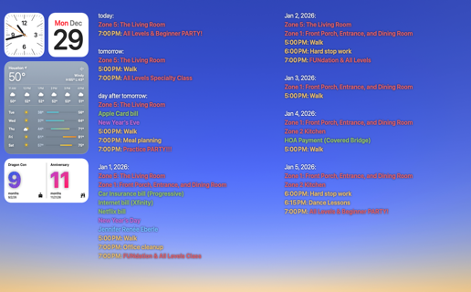

# iCalBuddy Color Widget for &Uuml;bersicht

A beautiful two-column calendar widget for your macOS desktop that
displays upcoming events from Apple Calendar using iCalBuddy's colorized
output.



> [!NOTE]
> The screenshot shows macOS desktop widgets on the left side (not
> included). This widget only provides the two-column calendar event
> list.

## Features

- Shows upcoming calendar events in a clean, two-column layout
- Color-coded events based on calendar colors
- Auto-updates every 10 minutes (configurable)
- Easy configuration - no need to dig through code
- Customizable positioning, fonts, and appearance

## Installation

### 1. Install &Uuml;bersicht

If you haven't already, download and install [&Uuml;bersicht][],
a macOS app that lets you run widgets on your desktop, either from the
website or via [Homebrew](https://brew.sh/):

```shell
brew install ubersicht
```

### 2. Install iCalBuddy

iCalBuddy is the command-line tool that fetches your calendar events.
You can download it from the [home page][iCalBuddy] or use
[Homebrew](https://brew.sh/):

```shell
brew install ical-buddy
```

### 3. Install This Widget

**Option A: Download directly**

1. Download this widget folder
2. Move it to: `~/Library/Application Support/&Uuml;bersicht/widgets/`
3. &Uuml;bersicht will automatically load it

**Option B: Clone via git**

```shell
cd ~/Library/Application\ Support/&Uuml;bersicht/widgets/
git clone https://codeberg.org/mjgardner/Uebersicht-iCalBuddy-Color.widget.git
```

### 4. Grant Calendar Access

When you first run the widget, macOS will ask for permission to access
your calendar data:

1. System Settings will open automatically
2. Enable calendar access for &Uuml;bersicht
3. The widget will start showing your events

## Configuration

All customization is done in the `CONFIG` section at the top of
`index.jsx`. Just open the file in any text editor and modify the
values.

### Common Customizations

#### Change Widget Position

```javascript
position: {
  top: 40,      // Distance from top of screen (pixels)
  left: 400,    // Distance from left (pixels)
  right: 40,    // Distance from right (pixels)
}
```

**Examples:**
- Full width at top: `top: 40, left: 40, right: 40`
- Right side only: `top: 100, left: 1200, right: 40`
- Bottom half: `top: 600, left: 100, right: 100`

#### Adjust Time Range

```javascript
calendar: {
  daysToShow: 7,  // Change to 3, 14, 30, etc.
}
```

#### Change Font Size

```javascript
appearance: {
  fontSize: 24,  // Try 18 for smaller, 32 for larger
}
```

#### Refresh Frequency

```javascript
calendar: {
  refreshMinutes: 10,  // Update every 10 minutes (60 = hourly)
}
```

#### Column Spacing

```javascript
appearance: {
  columnGap: 40,  // Space between columns in pixels
}
```

### Advanced Customizations

#### Custom iCalBuddy Path

If iCalBuddy is installed in a non-standard location:

```javascript
calendar: {
  icalBuddyPath: '/usr/local/bin/icalBuddy',  // Update this path
}
```

To find your iCalBuddy path:
```bash
which icalBuddy
```

#### Custom Event Colors

The widget uses ANSI color codes from iCalBuddy.
To customize how these map to colors:

```javascript
ansiColors: {
  31: '#ff0000',  // Red
  32: '#00ff00',  // Green
  34: '#0000ff',  // Blue
  // ... etc
}
```

## Troubleshooting

### Widget shows "iCalBuddy Not Found"

1. Check if iCalBuddy is installed:

   ```shell
   which icalBuddy
   ```

2. If not installed:

   ```shell
   brew install icalbuddy
   ```

3. If installed but widget can't find it, update the path in
   `CONFIG.calendar.icalBuddyPath`

### No Events Showing

1. Check if you have events in Apple Calendar for the next 7 days
2. Test iCalBuddy directly:

   ```shell
   /opt/homebrew/bin/icalBuddy eventsToday+7
   ```
3. Make sure &Uuml;bersicht has calendar access in System Settings >
   Privacy & Security > Calendars

### Widget Not Updating

1. Refresh &Uuml;bersicht from the menu bar
   (&Uuml;bersicht > Refresh All Widgets)
2. Check the refresh frequency in config (it's in minutes)
3. Check macOS Console app for error messages from &Uuml;bersicht

### Testing Your Configuration

You can test the exact command the widget runs:

```shell
/opt/homebrew/bin/icalBuddy --configFile '' --separateByDate \
  --propertyOrder datetime,title --propertySeparators '|: |\n    |' \
  --excludeEndDates --noCalendarNames --sectionSeparator '' \
  --bullet '' --formatOutput --includeEventProps title,datetime \
  eventsToday+7
```

This shows exactly what the widget will display.

## How It Works

1. Every `refreshMinutes`, &Uuml;bersicht runs the iCalBuddy command
2. iCalBuddy fetches events from Apple Calendar and outputs them with
   ANSI color codes
3. The widget parses the output, groups events by day, and splits them
   into two columns
4. ANSI color codes are converted to styled HTML elements
5. React renders the final two-column layout on your desktop

## Support

- For iCalBuddy issues:
    - [iCalBuddy homepage][iCalBuddy]
    - [GitHub repo](https://github.com/ali-rantakari/icalBuddy)
- For &Uuml;bersicht issues:
  [&Uuml;bersicht GitHub](https://github.com/felixhageloh/uebersicht)
- For widget-specific issues: Check the Issues tab of this repository

## Credits

Built with:
- [&Uuml;bersicht][]:
  Desktop widget framework
- [iCalBuddy][]:
  Calendar data extraction

[&Uuml;bersicht]: <https://tracesof.net/uebersicht/>
[iCalBuddy]:      <https://hasseg.org/icalBuddy/>
